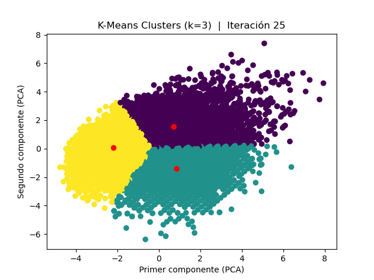

# K-Means: Implementación desde cero

- En este proyecto se implementa desde cero el algoritmo K-Means de *clustering* y se comparan los resultados con la implementación de Scikit Learn.  
- Como datos a estudiar se usa la base de datos del juego FIFA (año 2022) para separar los jugadores por categorias.   
- Se usan estos datos ya que la mayoría de las personas conoce a los jugadores más famosos y esto permite evaluar fácilmente los resultados. 

# Algoritmo K-Means

El algoritmo K-Means es una técnica de Clustering que permite dividir los datos en K grupos (*clusters*), donde los datos pertenecientes a un mismo *clusters* son semejantes entre sí.  

# Detalles del Proyecto

El proyecto se puede dividir a grandes rasgos en:

- Importación de librerías y de datos
- Preprocesamiento de datos
- Implementación manual de K-Means
  - Inicializar centroides
  - Asociar datos a centroides
  - Actualizar centroides
  - Loop
- Implementación de Scikit Learn de K-Means
- Análisis de resultados
  - Tabla de jugadores por clusters
  - Tabla comparativa de centroides 
- Comparación de resultados
  - Gráficos *scatter* de datos y de clusters
  - Gráfico comparativo de centroides
 
> El código está en el Jupyter Notebook **KMeana Implementacion Manual** con una explicación más detallada incluida.
 
## Importación librerías y de datos

Las librerías utilizadas son:
  - Numpy
  - Pandas
  - Scikit Learn

Los datos se descargaron en formato *.csv* desde Kaggle en este [link](https://www.kaggle.com/datasets/stefanoleone992/fifa-22-complete-player-dataset) y se cargaron usando Pandas.

## Preprocesamiento de datos

- Se extraen las columnas de interés (*features*) del Pandas.DataFrame que corresponden a:
  - *overall*: Nivel actual del jugador
  - *potential*: Potencial del jugador
  - *value_eur*: Valor de mercado del jugador en euros
  - *wage_eur*: Sueldo del jugador en euros
  - *age*: Edad del jugador

- Se realiza una normalización de los datos Max-Min para que ninguna *feature* tenga preferencia inicialmente.  
$${\displaystyle X'={\frac {X-X_{min}}{X_{max}-X_{min}}}}$$

## Implementación manual de K-Means

### Inicializar centroides

- Se toman k valores al azar por cada columna de *features* de los datos ya normalizados.
- La matriz resultante se transpone, así las filas correponden a las *feature* y las columnas a cada centroide inicial.

### Asociar datos a centroides

- Por cada jugador (*datapoint*) se calcula la distancia a cada centroide como:
  $$d(jugador, centroide) = \sqrt{\sum_{i=0}^{n°features}{(jugador[i]}-centroide[i])^2}$$
  > Donde *jugador[i]* corresponde al valor del *i-ésimo feature* del jugador.  
  > Donde *centroide[i]* corresponde al valor del *i-ésimo feature* del centroide.   
  > Y en este caso *n°features = 5*  
- Luego se asocia el jugador al centroide con la menor distancia

### Actualizar centroides

- Se actualizan los centroides como la media geométrica de *datapoints* ie. jugadores asociados.
  $$\displaystyle{nuevo \ centroide(c)[i] = \prod_{jugador(c)}^{n}jugador(c)[i]^{\frac{1}{n}}}$$
  > Donde *[i]* hace referencia a la *feature i-ésima* y *(c)* hace referencia al centroide *c-ésimo*.  
  > Se suma sobre todos los jugadores asociados al centroide *c-ésimo*.  
  > *n* corresponde al total de jugadores asociados al centroide *c-ésimo*.   
  > Notar que se realiza *feature* a *feature* para obtener un valor por *feature* para el nuevo centroide.  

### Loop
- Se realizan recursivamente los pasos de **Asociar datos a centroides** y de **Actualizar centroides** hasta que centroides dejan de cambiar o se cumple máximo número de iteraciones.

https://github.com/rhoffmannv/kmeans-manual/assets/44439632/a03fe554-2814-4fb6-935d-6fb8fad0ffd5

- En el video se puede ver como los centroides se van actualizando y sus jugadores asociados varian hasta estabilizarse.
- Se usó un valor *k=5* para el video.
- Se extraen dos componentes principales con PCA para poder graficar en 2D.

## Implementación de Scikit Learn de K-Means

- Se importa el modelo KMeans de la librería Scikit-Learn.
- Se crea instancia con valor de *k* deseado.
- Se ajusta a los datos con método *fit*.
- Los centroides se encuentran en la variable interna *cluster_centers_* del modelo KMeans.
- Las asociaciones de los jugadores se encuentran en la variable interna *labels_* del modelo KMeans.
  
# Análisis de Resultados

Se usa el valor *k=3* por simplicidad.

## Jugadores por cada cluster

- Para analizar los *clusters* obtenidos **manualmente** se crea una tabla con jugadores por centroide, que muestra 5 jugadores de cada *cluster*

  

- Se puede ver que los *clusters* encontrados exhiben cierta lógica:
  - El *cluster 0* está compuesto por los jugadores de elite.
  - El *cluster 1* está compuesto por jugadores que fueron de élite pero ya están al final de su carrera.
  - El *cluster 2* está compuesto por jugadores menos conocidos y jovenes.  

## Comparación *feature* a *feature*

- Se clasifican centroides (**manuales**) entre "Alto", "Medio" y "Bajo" *feature* a *feature*.
- Se reemplaza valor de feature de cada centroide por su posición relativa comparando el mismo feature con los otros centroides.

  

- Se confirma lo encontrado anteriormente:
  - El *cluster 0* contiene a los jugadores con mayor nivel, mayor precio y mayores sueldos.
  - El *cluster 1* contiene a los jugadores con mayor edad y bajo potencial futuro pero nivel intermedio.
  - El *cluster 0* contiene a los jugadores con menor edad, menor precio y menores sueldos, pero con potencial.
 
# Comparación de Resultados

## Gráficos *scatter*
- Se extraen dos componentes principales con PCA para poder graficar en 2D.
- Gráfico de todos los datapoints, con color asociado a *label* ie. centroide asociado.
- Se agregan los centroides en color rojo.

  
  

- El gráfico de la izquierda corresponde a los *clusters* encontrados manualmente y el gráfico de la derecha a los *clusters* encontrados por el algoritmo de Scikit-Learn
- Se puede ver que ambos dividen a los jugadores de manera similar.

## Gráfico comparativo de centroides

- Para comparar de manera directa ambos resultados, se grafican los 3 centroides manuales y los 3 centroides de Scikit-Learn.
- Se grafican los centroides manuales como círculos y centroides de Scikit-Learn como triángulos.

  

- Se puede ver que hay una clara asociación 1 a 1 entre los centroides y que están bastante cercanos por lo que es un buen resultado.
